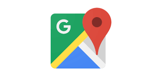
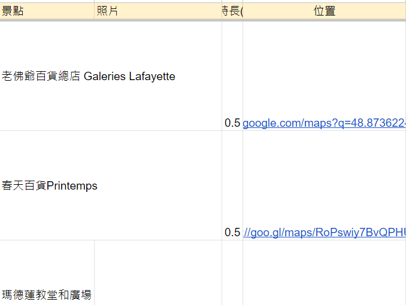

# googlemap-link
### To generate a Google Maps link for a location using the Google Maps API in Python, and access the address.

    
     
    the figure is accessed from https://www.google.com/url?sa=i&url=https%3A%2F%2Fwww.g2.com%2Fproducts%2Fgoogle-maps-api%2Freviews&psig=AOvVaw2192seiQ-dMx0UHcZSS4Xt&ust=1706602079859000&source=images&cd=vfe&opi=89978449&ved=0CBQQjhxqFwoTCIDf7aySgoQDFQAAAAAdAAAAABAD
    

[**googlemap-link**](https://github.com/jerryboy1031/googlemap-link) 

It is **authored by** [**陳佳俊**](https://github.com/jerryboy1031). It is **maintained by** [**陳佳俊**](https://github.com/jerryboy1031).

## Contents
1. [Results](#results)
2. [Features](#features)
3. [Contributors](#contributors)
4. [Installation](#installation)
5. [Send Us Feedback!](#send-us-feedback)
6. [License](#license)

## Results

- generate the Google Maps link, and access the information about a location

    
     
    figure is provided by 陳佳俊
    

- access the location address

    
     
    figure is provided by 陳佳俊
    

## Features

- main.py file

  to generate the Google Maps link, and access the information about a location
  - get_cell_val(col,row)
  - get_google_maps_link(location_name,api_key)
  - get_distance(location1, location2,api_key)
  - load_static_map_image(location,api_key)
  - get_place_id(location,api_key)
  - get_spot_details(location,api_key,row)
    
- main2.py file

  to access the location address
  - get_place經緯(location,api_key,placeID)

## Contributors
- [**陳佳俊**](https://github.com/jerryboy1031)

## Installation
required Python modules:
1. googlemaps 
2. requests
3. time
4. gspread
5. google.oauth2.service_account

install by `pip install ...`

## Send Us Feedback!
Our library is open source for research purposes, and we want to improve it! So let us know (create a new GitHub issue or pull request, email us, etc.) if you...
1. Find/fix any bug (in functionality or speed) or know how to speed up or improve any part of this project.
2. Want to add/show some cool functionality/demo/project made on top of it. We can add your project link to our project.

## License
OpenPose is freely available for free non-commercial use, and may be redistributed under these conditions. Please, see the [license](./LICENSE) for further details.
